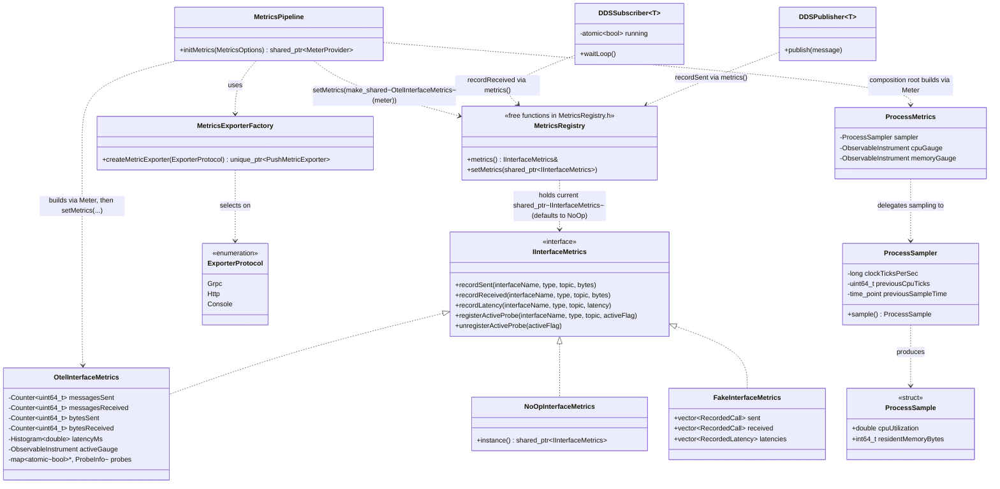
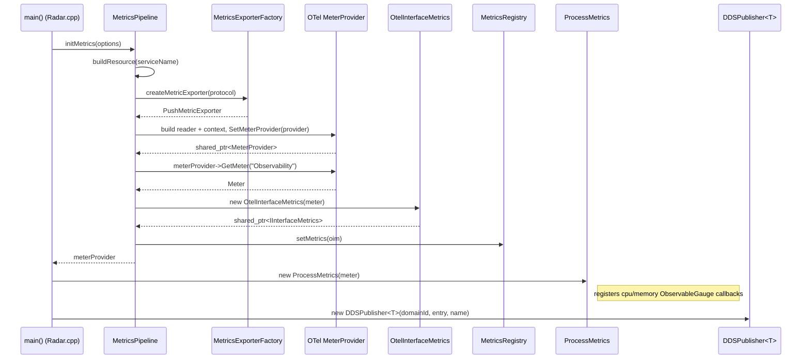
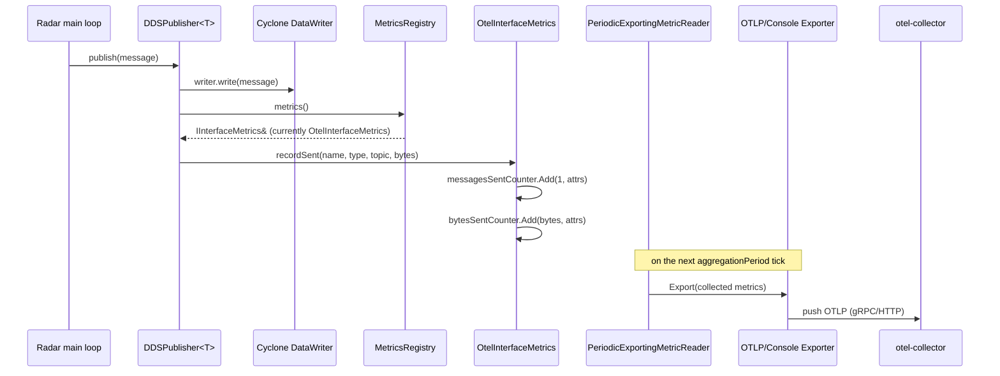
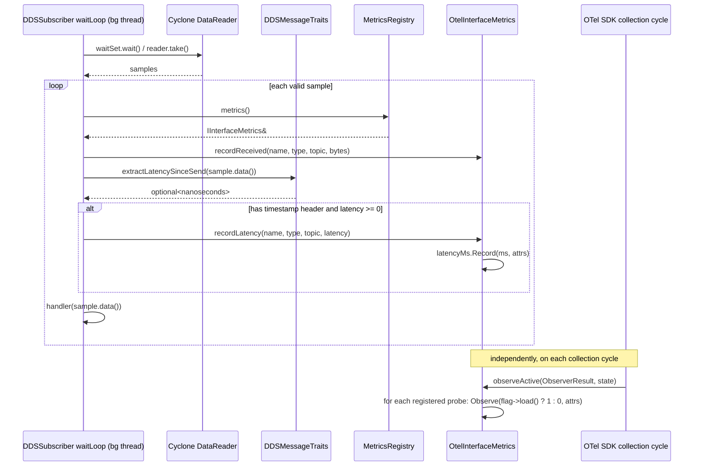
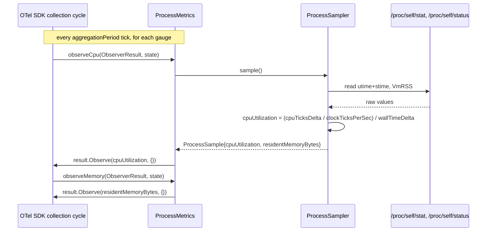

# Observability Module — Design Document

**Status:** Proposed — under review. Nothing in this document has been
implemented yet; it describes the target design for a SOLID / OpenTelemetry
redesign of the `Observability` module, for discussion before any code
changes land.

## Why redesign it?

The current `Observability` module (`src/libs/Observability/InterfaceMetrics.h`/
`.cpp`, `OtelLogSink.h`/`.cpp`) works and is simple, but demonstrates several
classic OO smells worth fixing:

- **No test seam** — `Observability::metrics()` is a Meyers singleton that
  hardcodes construction of `OtelInterfaceMetrics` internally. It's a
  Service Locator wearing an interface (`IInterfaceMetrics`), but the
  concrete type behind it can never actually be swapped: there's no way to
  substitute a test double or a no-op default. `DDSPublisher`/
  `DDSSubscriber` calling a global accessor is a deliberate, kept design
  choice in this redesign (matches existing call sites, no constructor
  churn) — the fix is making *what the global returns* swappable via a
  small registry (`setMetrics()`), not replacing the global accessor with
  constructor injection. This is a conscious global-state tradeoff, not an
  oversight: it trades per-instance substitutability for zero call-site
  changes.
- **SRP violation** — `InterfaceMetrics.cpp` and `OtelLogSink.cpp` each mix
  three responsibilities in one file: OTel SDK pipeline construction
  (exporter, reader/processor, resource, provider registration), the actual
  recording/business logic, and the global provider registration side
  effect. The two files also duplicate ~25 lines of near-identical
  scaffolding between the metrics and logs paths.
- **OCP violation** — the exporter transport (OTLP/gRPC) is hard-coded, even
  though OTLP/HTTP is already built by the project's Dockerfile and
  currently unused. Swapping transport requires editing and recompiling the
  library rather than changing a config value.
- **Underused OTel surface** — only 4 counters exist today. OpenTelemetry
  offers histograms, observable (pull-based) gauges, Views, and richer
  resource semantic conventions, none of which are used.
- **No tests** — nothing exercises `Observability` directly, and the
  existing DDS unit tests can't assert anything about metrics because
  there's no seam to substitute a test double.

## Goals

- Fix the issues above with a small number of well-named,
  well-motivated abstractions — a textbook SOLID example, not a deep
  enterprise hierarchy.
- Expand the emitted signal set: a send→receive latency histogram, an
  observable gauge for subscriber activity, and observable gauges for
  process CPU/memory usage — while giving the reader hands-on exposure to
  more of the OTel API surface (histograms, Views, observable/pull
  instruments, resource semantic conventions, exporter selection).
- Make the OTLP transport (gRPC vs HTTP) a configuration choice instead of a
  compile-time one.

**Explicitly out of scope for this pass:** distributed tracing/spans,
trace-context propagation through DDS message headers, baggage propagation,
exemplars, and log-trace correlation. These are natural next steps once the
team wants to go further — see
[What's Not Here Yet](#whats-not-here-yet).

## Push vs. pull instruments

OpenTelemetry has two fundamentally different ways an instrument gets its
value, and this design deliberately uses both:

- **Synchronous (push)** — `Counter::Add()`, `Histogram::Record()`. Code
  calls these inline, at the moment an event happens. `recordSent`,
  `recordReceived`, and `recordLatency` all work this way: a message is
  published or received, so the call site immediately pushes a value.
- **Asynchronous / Observable (pull)** — `ObservableGauge`. A callback is
  registered once, and the OTel SDK calls it on its own schedule (every
  `aggregationPeriod`), asking "what's the value right now?" There's no
  event to hook for "a subscriber is idle" or "how much memory is the
  process using right now" — nothing *happens* — so the SDK has to come and
  ask. `interface.subscriber.active`, `process.cpu.utilization`, and
  `process.memory.usage` are all observable gauges for this reason.

A **probe**, in this design, is not an OTel term — it's the app-level
registration record (`registerActiveProbe`/`unregisterActiveProbe`) that
lets multiple `DDSSubscriber` *instances* report into one shared
`interface.subscriber.active` gauge instrument. OTel's `ObservableGauge` is
normally a singleton per `Meter`, with one callback expected to report
values for every attribute-combination that exists — but `DDSSubscriber`
instances come and go at runtime and the gauge doesn't know about them on
its own. Each subscriber hands over a pointer to its own `atomic<bool>
_running` flag in its constructor; `OtelInterfaceMetrics` keeps these in a
map and walks it once per collection cycle. Process CPU/memory sampling
needs no such registry — there's exactly one process, so one callback
samples and reports directly.

## Class diagram

Three design points worth calling out:

- `NoOpInterfaceMetrics` and `FakeInterfaceMetrics` both implement
  `IInterfaceMetrics` alongside the real `OtelInterfaceMetrics`. This is
  what fixes the "no test seam" problem described above — any of the three
  can be registered via `setMetrics()` and picked up by every caller of
  `Observability::metrics()`: the OTel-backed one in production, the no-op
  one as the default before `initMetrics()` runs, the fake one in tests
  (scoped with `ScopedMetrics`, see Phase D of the implementation plan).
  `DDSPublisher`/`DDSSubscriber` never see any of the three types directly —
  they only call the interface through the registry accessor.
- The registry (`metrics()`/`setMetrics()`) is two free functions living in
  their own header, `MetricsRegistry.h`. It can't live in `IInterfaceMetrics.h`
  because its default value is a `NoOpInterfaceMetrics`, and
  `IInterfaceMetrics.h` can't depend on a class that implements it without a
  circular include — so the include chain is one-directional:
  `MetricsRegistry.h` includes `NoOpInterfaceMetrics.h`, which includes
  `IInterfaceMetrics.h`. In C++11 (no inline variables), the standard way to
  get one process-wide instance from a header is a function-local `static`
  inside an `inline` function, which is guaranteed to be merged to a single
  definition across translation units by the ODR. This is intentionally
  global, mutable state: it trades per-instance dependency injection for
  zero call-site/constructor changes in `DDSPublisher`/`DDSSubscriber`.
- `ProcessMetrics` has no dependency on `IInterfaceMetrics` or DDS at all —
  it's a sibling of `OtelInterfaceMetrics` under the same `Meter`, not a
  subtype. Process resource usage and interface traffic are separate
  concerns (SRP), and both happen to be implemented with OTel instruments.

## Sequence diagrams

### 1. Process startup (composition root)

`main()` is the **composition root**: it's the only place that knows about
concrete OTel types and wires them together. `initMetrics()` registers the
real recorder into the global registry as its last step, so everything
downstream (`DDSPublisher`, `DDSSubscriber`) can just call
`Observability::metrics()` with no constructor argument and reach the
`IInterfaceMetrics` interface — never a concrete type.

### 2. Publish path

### 3. Receive path with latency + active-probe gauge

`extractLatencySinceSend` is a compile-time trait
(`has_timestamp_header_v<T>`), not a runtime check — message types without a
`header().timestamp_ns()` (e.g. the DDS test suite's `TestMessage`) simply
never call `recordLatency`, with the branch compiled out via `if constexpr`.
No IDL changes are required for message types that don't opt in.

### 4. Process CPU/memory sampling (pull, no registry needed)

`ProcessSampler` has no OTel dependency at all — it's pure logic
(read `/proc`, compute a delta) that `ProcessMetrics` wraps with OTel
plumbing. This mirrors the same split used for `OtelInterfaceMetrics` vs.
`MetricsPipeline`: keep SDK wiring separate from the logic that actually
produces a value, so the logic can be unit-tested without an SDK in the
loop.

## Why Views? (histogram bucket boundaries)

OTel's default histogram bucket boundaries are tuned for HTTP-request
durations measured in seconds — wrong for loopback DDS latencies that live
in the microsecond-to-low-millisecond range. Without an explicit View, the
`interface.latency` histogram would bucket essentially all observations
into the same "very fast" bucket, making the histogram useless for
percentile estimation. The design registers one explicit View with
millisecond-scale boundaries (e.g. `{0.05, 0.1, 0.25, 0.5, 1, 2.5, 5, 10, 25,
50, 100, 250, 500}` ms) via the SDK's `ViewRegistryFactory`/`ViewFactory` —
this is the concrete reason Views exist as a concept: they let you retarget
an instrument's aggregation behavior without changing the instrumentation
call site.

## What's not here yet

Deliberately out of scope for this pass, and worth exploring as natural
next steps once the team wants to go further:

- **Distributed tracing/spans** — linking a span from `Radar`'s `publish()`
  to `Workstation`'s receive handler into one trace would need a
  `traceparent`-equivalent field propagated through the DDS message header
  (an IDL change), plus `Tracer`/`Span` wiring parallel to the metrics
  pipeline here.
- **Baggage propagation** — passing cross-cutting metadata (e.g. a
  correlation ID) across process boundaries via DDS message headers,
  analogous to HTTP baggage headers.
- **Exemplars** — linking histogram bucket observations back to the trace
  ID that produced them, which requires tracing to exist first.
- **Log-trace correlation** — enriching `OtelLogSink` log records with the
  current span's `trace_id`/`span_id`, also requires tracing to exist
  first.
