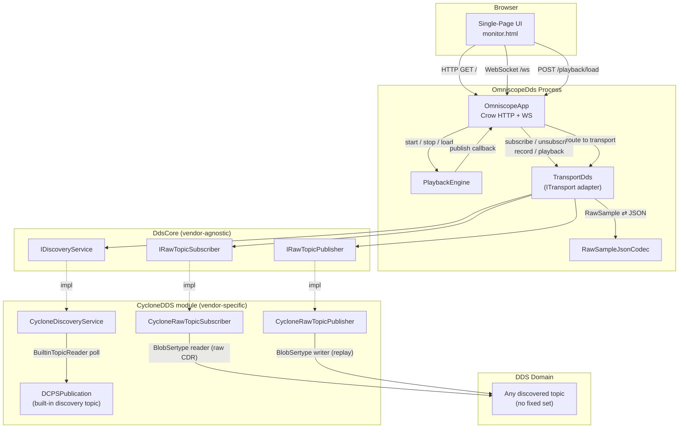
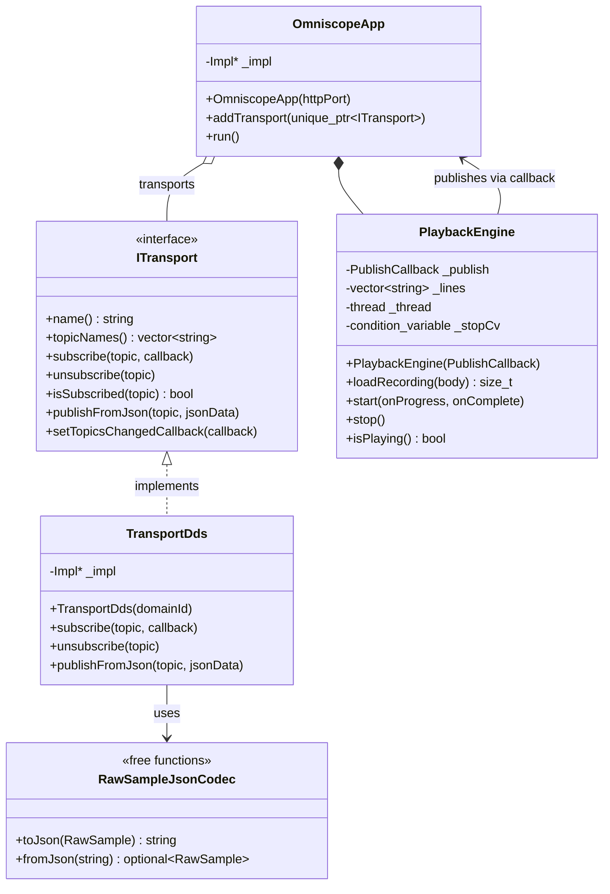
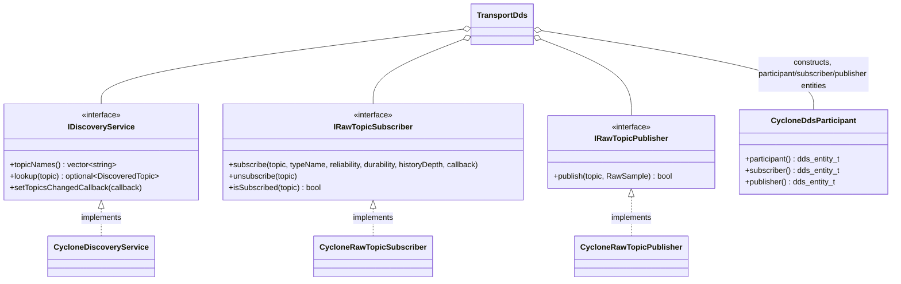
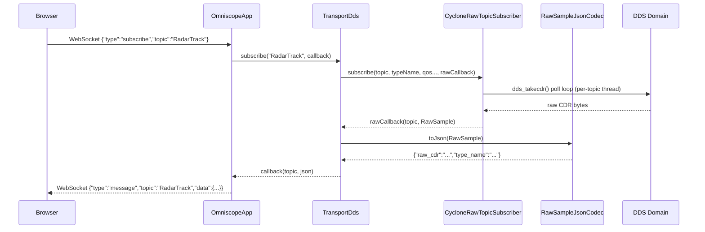
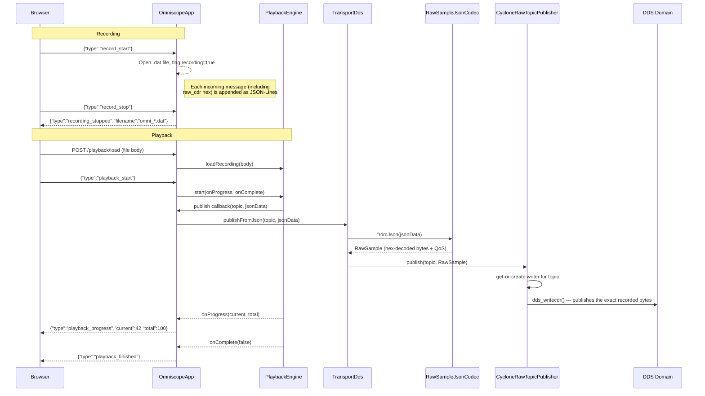

# OmniscopeDds Design

OmniscopeDds is a web-based DDS traffic inspector that lets you monitor,
record, and replay messages flowing through a Cyclone DDS domain in real
time from a browser, with fully dynamic topic discovery — no compiled-in
IDL types or fixed topic list required.

It is the result of merging two earlier apps: Omniscope (the web UI,
recording, and playback engine) and DdsSnooper (dynamic DDS topic
discovery via CycloneDDS's built-in discovery topics). All of DdsSnooper's
capability is preserved, plus playback now actually re-publishes onto the
DDS domain instead of being a stub.

## Technology Stack

| Component                   | Technology                                                       | Purpose                                                                                                                                          |
| --------------------------- | ---------------------------------------------------------------- | -------------------------------------------------------------------------------------------------------------------------------------------------------- |
| **HTTP / WebSocket server** | [Crow](https://crowcpp.org/) 1.3                                 | Lightweight C++ micro-framework (header-only, BSD-3). Serves the single-page UI and provides the `/ws` WebSocket endpoint for live message streaming.    |
| **DDS middleware**          | [Eclipse Cyclone DDS](https://cyclonedds.io/) 0.10               | OMG Data Distribution Service implementation used by `TransportDds`. Topics are discovered dynamically at runtime — no compiled-in IDL types.            |
| **Logging**                 | [spdlog](https://github.com/gabime/spdlog) (via `GeneralLogger`) | Async structured logging throughout the application.                                                                                                     |
| **Build**                   | CMake 3.25+ with presets                                         | The HTML/CSS/JS are embedded at build time via `EmbedAsset.cmake` so the binary is fully self-contained — no external files needed at runtime.            |
| **Language**                | C++20                                                            | Uses `std::format`, `std::atomic`, and concepts from the C++20 standard.                                                                                  |

## Architecture



A future DDS vendor (e.g. RTI Connext) is added by writing new concrete
implementations of the three `DdsCore` interfaces (e.g. an `RTIDds` module)
and constructing them in place of the `Cyclone*` classes inside
`TransportDds`'s constructor — `OmniscopeApp`, `PlaybackEngine`, the web UI,
and `TransportDds`'s own logic are unaffected.

## Class Diagram



### DdsCore seam (inside TransportDds)

`TransportDds` no longer talks to CycloneDDS directly — it composes three
`DdsCore` abstractions and translates between `ITransport`'s JSON currency
and `DdsCore`'s raw-bytes currency (`RawSample`). This is a second,
vendor-swap seam nested inside the `ITransport` seam above.



`DdsCore` (`src/libs/DdsCore/`) is header-only and depends on nothing but
the standard library — no CycloneDDS, no vendor SDK. `Cyclone*` concrete
classes live in `src/libs/CycloneDDS/` and are the only place that still
touches the CycloneDDS C API / `BlobSertype` for this app.

## Data Flow

### Live Monitoring



### Recording & Playback (Wire-Level Replay)



**Playback routing does not depend on live discovery.** Unlike live
`subscribe`/`unsubscribe` (which route through `findTransport()`, matching
the topic against each transport's currently-discovered `topicNames()`),
the playback publish callback in `OmniscopeApp::run()` calls
`publishFromJson()` on *every* registered transport unconditionally. This
is intentional, not an oversight: replaying a topic is precisely the case
where its original live publisher may no longer be discovered (the
publisher process may be long gone), or may never have been discovered by
this process at all (e.g. a freshly-started instance loading a recording
made by a different, earlier process/instance). Gating playback on
`topicNames()` silently drops every replayed message with no visible
error — `PlaybackEngine` still reports `playback_started`/
`playback_progress`/`playback_finished` normally, since it has no
visibility into whether the publish callback actually did anything.

**Wire-level replay, not JSON re-encoding.** Since the JSON captured for
each message already contains the raw CDR bytes (`raw_cdr`, hex-encoded),
`publishFromJson()` doesn't need to know the compiled type to re-encode a
sample — `RawSampleJsonCodec::fromJson()` hex-decodes the bytes into a
`DdsCore::RawSample`, and `CycloneRawTopicPublisher` publishes it verbatim
via `ddsi_serdata_from_ser_iov()` + `dds_writecdr()`, using a lazily-created
`BlobSertype`-based writer (Reliable/Volatile/KeepLast(1) QoS — Reliable
because it's compatible with both Reliable- and BestEffort-requesting
readers per DDS RxO rules). This was verified end-to-end: an independent
subscriber, already matched with the writer, received the replayed bytes
byte-for-byte identical to the original recording. The one caveat inherent
to DDS itself (not specific to this implementation): the very first sample
published on a brand-new writer can be lost if the reader hasn't finished
matching yet — this doesn't affect steady-state playback of multiple
samples on an already-active topic.

## Shutdown Sequence

`OmniscopeApp::run()` blocks in Crow's `.multithreaded().run()`, which
handles SIGINT/SIGTERM itself and returns when signaled — there is no
explicit `signal_clear()`/`crowApp.stop()` call. After `run()` returns,
`OmniscopeApp::run()` calls `playback->stop()`, and `~OmniscopeApp()` calls
it again (idempotent, harmless). Member destruction then proceeds in
reverse declaration order: `transports` is declared before `playback` in
`OmniscopeApp::Impl`, so on destruction `playback` (declared later) is torn
down *first*, and `TransportDds` (inside `transports`) is destroyed
*after* — meaning no in-flight playback can race with `TransportDds`
tearing down its participant/readers/writers.

`PlaybackEngine` uses a `std::condition_variable` for its inter-message
sleep so that `stop()` wakes it immediately rather than blocking up to 5
seconds.

## Transport Extensibility

OmniscopeDds is designed around the `ITransport` interface. Currently only
`TransportDds` (Cyclone DDS, dynamic discovery) is included, but the
interface is implementation-agnostic — an entirely different pub/sub
middleware could be added as a new transport without touching
`OmniscopeApp`. Adding a new transport requires:

1. Create a class that implements `ITransport`.
2. Instantiate it in `main.cpp` and register via `app.addTransport()`.
3. OmniscopeDds discovers topics automatically via `topicNames()`.

No changes to `OmniscopeApp`, `PlaybackEngine`, or the web UI are
necessary.

### Swapping the DDS vendor (e.g. Cyclone → RTI)

For the common case of swapping the *DDS vendor* underneath `TransportDds`
rather than adding a wholly different middleware, there's a second, narrower
seam: `TransportDds` doesn't call CycloneDDS APIs itself. It composes three
`DdsCore` interfaces (`IDiscoveryService`, `IRawTopicSubscriber`,
`IRawTopicPublisher` — see "DdsCore seam" above) and is otherwise vendor-
agnostic. `DdsCore` (`src/libs/DdsCore/`) has no dependency on any vendor
SDK; it exchanges topic name, type name, QoS, and raw CDR bytes, matching
exactly what CycloneDDS's `BlobSertype` mechanism already provides.

To add an RTI Connext backend:

1. Create an `RTIDds` module implementing `DdsCore::IDiscoveryService`,
   `IRawTopicSubscriber`, and `IRawTopicPublisher` (pulling raw bytes out of
   RTI's `DynamicData` API instead of a hand-rolled blob sertype).
2. In `TransportDds`'s constructor, construct the `RTIDds::*` classes in
   place of the `CycloneDDS::Cyclone*` classes.

`TransportDds`'s own logic (JSON ⇄ `RawSample` translation via
`RawSampleJsonCodec`), `OmniscopeApp`, `PlaybackEngine`, and the web UI are
all unaffected.

## WebSocket Protocol

All browser↔server communication (except the initial page load and file
upload) flows over a single WebSocket at `/ws`. Messages are JSON
objects with a `"type"` field:

### Client → Server

| Type             | Fields  | Description                               |
| ---------------- | ------- | ----------------------------------------- |
| `subscribe`      | `topic` | Start receiving live messages for a topic |
| `unsubscribe`    | `topic` | Stop receiving messages for a topic       |
| `record_start`   | —       | Begin recording incoming messages to disk |
| `record_stop`    | —       | Stop recording                            |
| `playback_start` | —       | Start replaying the loaded recording      |
| `playback_stop`  | —       | Stop an in-progress playback              |

### Server → Client

| Type                | Fields                       | Description                                                                               |
| ------------------- | ---------------------------- | ----------------------------------------------------------------------------------------- |
| `topics`            | `topics[]`                   | Full topic list with subscription state (sent on connect and after subscribe/unsubscribe) |
| `message`           | `topic`, `timestamp`, `data` | A live or replayed message; `data` includes `raw_cdr`, `byte_count`, `type_name`          |
| `recording_started` | —                            | Acknowledge recording start                                                               |
| `recording_stopped` | `filename`                   | Acknowledge recording stop, return filename                                               |
| `recording_loaded`  | `count`                      | A recording file was uploaded and parsed                                                  |
| `playback_started`  | `count`                      | Playback has begun                                                                        |
| `playback_progress` | `current`, `total`           | Periodic progress update                                                                  |
| `playback_finished` | —                            | Playback completed normally                                                               |
| `playback_stopped`  | —                            | Playback was stopped by the user                                                          |

## HTTP Endpoints

| Method | Path             | Description                                  |
| ------ | ---------------- | -------------------------------------------- |
| `GET`  | `/`              | Serves the embedded single-page HTML UI      |
| `GET`  | `/style.css`     | Serves the embedded stylesheet               |
| `GET`  | `/app.js`        | Serves the embedded client-side JavaScript   |
| `POST` | `/playback/load` | Upload a `.dat` JSON-Lines file for playback |

## Recording File Format

Recordings are stored as JSON-Lines (`.dat`), one message per line:

```json
{"topic":"RadarTrack","timestamp":"2026-03-14T12:00:00.123Z","timestamp_ms":1773576000123,"data":{"raw_cdr":"...","byte_count":84,"type_name":"radar_demo::RadarTrack"}}
```

## File Layout

```
src/apps/OmniscopeDds/
├── CMakeLists.txt          # Build config, web asset embedding, link Crow + CommonUtils + CycloneDDSLib + DdsCore
├── ITransport.h            # Abstract transport interface
├── PlaybackEngine.h/.cpp   # Recording playback with original timing
├── OmniscopeApp.h/.cpp     # Crow HTTP/WS orchestrator (pImpl)
├── TransportDds.h/.cpp     # ITransport adapter composing DdsCore abstractions (pImpl)
├── RawSampleJsonCodec.h/.cpp  # DdsCore::RawSample ⇄ wire-JSON envelope (no DDS dependency)
├── main.cpp                # Entry point, argument parsing
└── web/
    ├── monitor.html        # Single-page browser UI markup
    ├── style.css            # Stylesheet
    └── app.js               # Client-side JavaScript (WebSocket protocol, UI logic)
```

Each of the three `web/` files is embedded into the binary at build time as
a C++ raw string (via `embed_web_asset()` in `src/apps/EmbedAsset.cmake`)
and served from its own route (`/`, `/style.css`, `/app.js`) — the browser
loads them the normal way via `<link>`/`<script src>`, but the binary
remains fully self-contained with no external files needed at runtime.

`TransportDds` depends on two lower layers:

```
src/libs/DdsCore/                  # Vendor-agnostic interfaces + types, no vendor SDK dependency
├── DdsTypes.h                     # DiscoveredTopic, RawSample, callback aliases
├── IDiscoveryService.h
├── IRawTopicSubscriber.h
└── IRawTopicPublisher.h

src/libs/CycloneDDS/               # CycloneDDS-specific implementations of DdsCore interfaces
├── CycloneDdsParticipant.h/.cpp   # Owns participant/subscriber/publisher entity lifecycle
├── CycloneDiscoveryService.h/.cpp # Wraps BuiltinTopicReader; implements IDiscoveryService
├── CycloneRawTopicSubscriber.h/.cpp  # Wraps BlobSertype reader path; implements IRawTopicSubscriber
├── CycloneRawTopicPublisher.h/.cpp   # Wraps BlobSertype writer path; implements IRawTopicPublisher
├── BlobSertype.h/.cpp              # Type-erased raw-CDR sertype (the actual "any type" mechanism)
├── BuiltinTopicReader.h/.cpp       # Low-level DCPSPublication poller
└── DDSSubscriber.h / DDSPublisher.h / DDSTopicConfig.h  # Unrelated: compile-time-typed templates used by RadarDDSDemo
```

`tests/OmniscopeDdsTests/` covers `RawSampleJsonCodec` (encode/decode
round-trips and malformed-input handling) with zero DDS dependency —
`gtest_discover_tests`-registered, runs under `ctest`.

## Usage

```bash
# Build
cmake --build --preset debug-san

# Run with defaults (domain 0, port 8080)
./build/debug-san/bin/OmniscopeDds

# Run with custom DDS domain and HTTP port
./build/debug-san/bin/OmniscopeDds 1 9090

# Open in browser
xdg-open http://localhost:8080
```

From the browser UI you can:

1. **Subscribe** to any dynamically discovered topic to see live messages.
2. **Record** traffic to a `.dat` file.
3. **Upload** a previous recording and **play it back** — this
   re-publishes each message onto the DDS domain with original timing,
   using the exact captured wire bytes.
4. **Stop** playback at any time.

Press **Ctrl+C** in the terminal to shut down cleanly.
